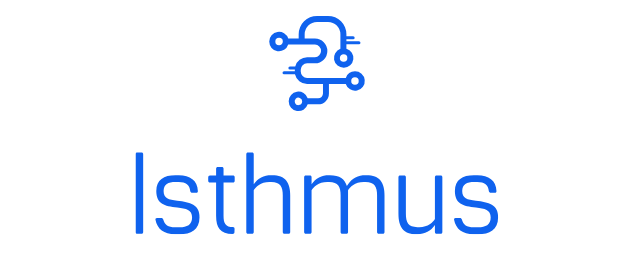

# Isthmus

# Overview

**Find our complete project documentation [here](https://isthmus.gitbook.io/isthmus/)!**

Isthmus is a boilerplate application framework built for building Location Intelligence applications with CARTO and with React and Redux. It is built to incorporate core CARTO libraries such as CARTO.js and Airship, make common tasks such as adding layers and creating a map simple, and includes core technology for developing, bundling, and creating production versions of your application a simple process.

## Core Technology

Below is a short list of some of the core tech and libraries that are used in Isthmus:

- [CARTO.js](https://carto.com/developers/carto-js/)
- [Airship](https://carto-airship.netlify.com/)
- [Leaflet](https://leafletjs.com/)
- [React](https://reactjs.org/)
- [Redux](https://redux.js.org/)
- [Babel](https://babeljs.io/)
- [Webpack](https://webpack.js.org/)
- [Express](https://expressjs.com/)
## Features

What does Isthmus do? Here are some of the great things you can do with Isthmus:

- Start a location intelligence application without adding multiple packages
- Easily add layers to your map and maintain a global state for CARTO settings
- Simple and easy to use global application state with layers, map location, and other details
- Quick commands for development, production, and deployment
- All the tools you need to build location intelligence apps with CARTO in one location
# Documentation
## Getting Started

To get started, make sure you have Yarn installed on your computer. For installation instructions go [here](https://yarnpkg.com/en/docs/install#mac-stable).

First, clone the repo to your desired location:

    git clone https://github.com/mbforr/isthmus-react.git

Them move into the Isthmus folder:

    cd isthmus-react

To configure all the required packages simply run Yarn:

    yarn

This should install all the necessary packages and you should be ready to go!

## Starting Isthmus

To get Isthmus started and to begin developing your application you can run:

    yarn run dev

This will start a local server running at http://localhost:8080 (or another port if you have a server running at this port already). This will also open another window at http://localhost:9000 which is a Webpack Bundle Analyzer to see the size of the Webpack bundle and associated packages.

This will open your development environment and includes hot reloading, which will refresh the page after a change has been saved.

If you are new to using Yarn and creating a React based project you can check out tis

## Other Commands
- To run a simple build use `yarn run build`
- To run a complete production build with production minified .js files use `yarn run prod`
- To start a server to view build or production files use `yarn run start`

A complete production workflow would use `yarn run prod` and then `yarn run start` as the command for the server to start the application once it has been deployed.

## Configuring Your Map

Once you have your development server up and running, you can set your global map and CARTO account settings for your application. Navigate to `../src/data/C.js` and  you will see the following settings:

    const C = {
        SQL_API_URL: 'https://username.carto.com/api/v2/sql?q=',
        BASEMAP: 'https://{s}.basemaps.cartocdn.com/rastertiles/voyager_nolabels/{z}/{x}/{y}.png',
        BASEMAP_LABELS: 'https://{s}.basemaps.cartocdn.com/rastertiles/voyager_only_labels/{z}/{x}/{y}.png',
        USERNAME: 'username',
        API_KEY: 'default_public',
        CENTER: [33.753707, -84.389363],
        ZOOM: 6
    };

    export default C

Simply change any of these variables to configure your map settings and they will be imported into the correct components to render your map properly. That’s it!

## Adding Layers

To add layers to your map navigate to `../src/data/layers/` and you will see two files:

- `railaccidents.js` - a sample layer configuration file
- `index.js` - the main configuration file for all layers

To add a layer you can either copy the `railaccidents.js` layer or modify that layer file. Keep in mind that the name of that file will be the name of the layer variable in the application state.

    export default {
      name: 'Rail Accidents',
      visible: true,
      cartocss: `
      #layer {
        marker-width: 7;
        marker-fill: ramp([equipment_damage], (#f3e79b, #fac484, #f8a07e, #eb7f86, #ce6693, #a059a0, #5c53a5), quantiles);
        marker-fill-opacity: 1;
        marker-allow-overlap: true;
        marker-line-width: 1;
        marker-line-color: #FFFFFF;
        marker-line-opacity: 1;
      }
      `,
      query: `
        SELECT * FROM rail_accidents
      `
      }
    };

The following elements must be added for your layer to show up:

| `name`     | Name of your layer                                |
| ---------- | ------------------------------------------------- |
| `visible`  | Boolean for the starting visibility of your layer |
| `cartocss` | CartoCSS for the styling of your layer            |
| `query`    | Starting PostGIS query for your layer             |

Once these are set you can save you layer and open the `index.js` file

    import railaccidents from './railaccidents';
    import states from './states';

    // Export order will be the layer order
    export default {
      states,
      railaccidents
    }

If I were to add a new layer called states, all I need to do is to import that new layer into the `index.js` file and then set the order of the layers. The bottom most layer will be on top, so in this example `railaccidents` will show up on top of the `states` layer. That’s it!
